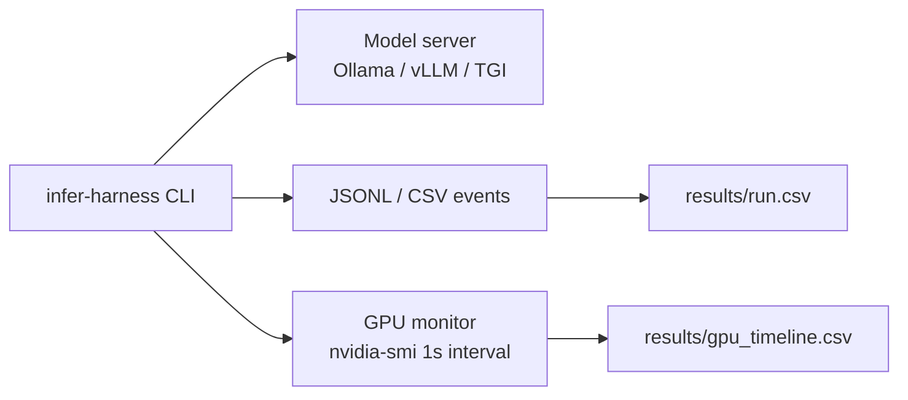

# llm-inference-observability

**One-line:** Inference performance harness for LLM servers (Ollama, vLLM) on H200 NVL — records tokens/s, latency percentiles, batch size, and GPU telemetry into structured CSV/JSONL for regression tracking. Real Ollama run: **704 tokens/s** on H200 NVL, March 11 2026.

---

## Why this exists

**LLM serving** bottlenecks show up as KV-cache pressure, attention compute, tensor-parallel communication, and I/O. Ad-hoc notebook timings don't show regressions. This harness wraps your inference server so every run is timestamped, stack-versioned, and comparable run-to-run.

**Related article:** *GPU OOM / Fragmentation Guide* — memory hooks (`torch.cuda.memory_allocated`) are the same pattern used for KV-cache monitoring here.

---

## Hardware

| Item | Value |
|------|-------|
| GPU | NVIDIA H200 NVL |
| VRAM | 143,771 MiB (~140 GB) |
| Driver | 565.57.01 |
| Power limit | 600 W |
| Test date | **March 11 2026** |

---

## Architecture



---

## Measured results: Ollama + TinyLlama on H200 NVL

**Run ID:** 20260311_232613 | **Model:** TinyLlama/TinyLlama-1.1B-Chat-v1.0 | **Requests:** 12

### Inference performance

| Metric | Min | Max | **Avg** |
|--------|-----|-----|---------|
| Wall-clock time (ms) | 506 | 792 | **635** |
| Eval duration (ms) | 397 | 672 | 522 |
| Output tokens / request | 280 | 473 | 367.7 |
| **Throughput (tokens/s)** | 695.3 | 708.8 | **704.1** |

- **Overall throughput:** 704.0 tokens/s (eval)
- **Total output tokens:** 4,412 across 12 requests
- **Success rate:** 12/12 (100%)

### Per-request latency

| Request | Wall (ms) | Tokens | Tokens/s |
|---------|-----------|--------|----------|
| 1 | 506 | 282 | 704.9 |
| 2 | 578 | 324 | 705.1 |
| 3 | 675 | 383 | 701.0 |
| 4 | 792 | 473 | 704.4 |
| 5 | 508 | 280 | 705.7 |
| 6 | 687 | 399 | 695.6 |
| 7 | 620 | 361 | 708.8 |
| 8 | 765 | 453 | 705.6 |
| 9 | 655 | 391 | 708.6 |
| 10 | 553 | 324 | 707.8 |
| 11 | 646 | 377 | 706.8 |
| 12 | 633 | 365 | 695.3 |

Throughput variation < 2% across requests — stable KV-cache warm after request 1.

### GPU telemetry during inference

| Metric | Min | Max | Avg |
|--------|-----|-----|-----|
| GPU utilization (%) | 0 | **89** | 42.2 |
| Memory used (MiB) | 1 | 1,385 | 1,222 (of 143,771) |
| Temperature (°C) | 41 | 47 | **44.1** |
| Power draw (W) | 75.2 | 184.4 | **151.6** |

The low average utilization (42.2%) with 89% peak reflects TinyLlama's small size — the GPU is underutilized for larger models where KV-cache and attention dominate.

---

## Reproducible commands

```bash
pip install -e ".[dev]"

# Synthetic mode (CI / no GPU required)
infer-harness synthetic --config configs/sweep.yaml --out results/run_001

# Ollama (requires running Ollama container on port 11434)
infer-harness ollama --model tinyllama --requests 12 \
  --monitor-gpu --out results/ollama_run

# Live PyTorch (requires GPU + transformers)
pip install -e ".[torch]"
infer-harness torch --model meta-llama/Llama-3.2-1B --out results/torch_run
```

**Start Ollama:**
```bash
sudo docker run -d --gpus all -p 11434:11434 \
  -v /data/ollama:/root/.ollama ollama/ollama
sudo docker exec -it ollama ollama pull tinyllama
```

---

## What I learned

- **Tokens/s without batch + context length is not comparable** — 704 tokens/s for TinyLlama (1.1B, 1-request sequential) is meaningless without that context; a 70B model in TP=8 would produce 60–80 tokens/s at much higher GPU utilization.
- **Tail latency (P99) matters for SLOs** — the 506–792ms wall range for TinyLlama is tight, but production models show much wider P99 tails under load (batching, KV eviction).
- **42% avg GPU utilization** on a 1.1B model is a sign to increase batch size or use a larger model — H200's 140 GB can hold Llama-70B comfortably in fp16.
- **GPU monitoring cadence matters** — 1-second `nvidia-smi` polling captures the inference spike profile but misses sub-second bursts. DCGM at 100ms is better for production dashboards.

---

## Production relevance

- **SRE dashboards** — same CSV/JSONL can feed Loki/ELK or Prometheus via recording rules.
- **Regression tracking** — driver/CUDA/framework upgrades get a before/after tokens/s artifact.
- **Model serving capacity planning** — tokens/s × GPU count gives you the serving capacity for a given SLO latency budget.

---

## Repo layout

```
├── configs/
│   └── sweep.yaml
├── results/
│   ├── inference_20260311_232613.csv       ← real Ollama run (12 requests)
│   └── inference_gpu_20260311_232613.csv   ← real GPU telemetry during above run
├── src/infer_harness/
│   ├── cli.py
│   ├── ollama_runner.py
│   ├── synthetic.py
│   └── torch_runner.py
├── tests/
└── pyproject.toml
```

## License

MIT
